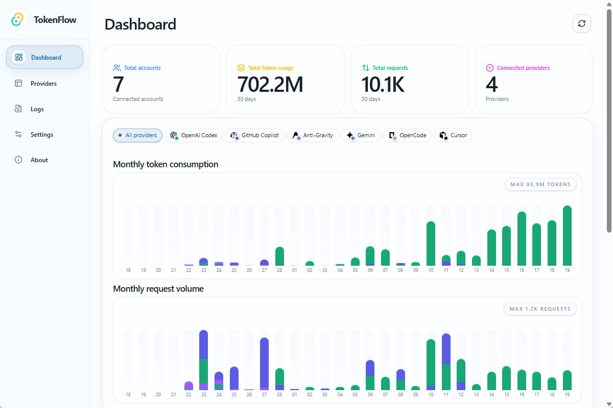
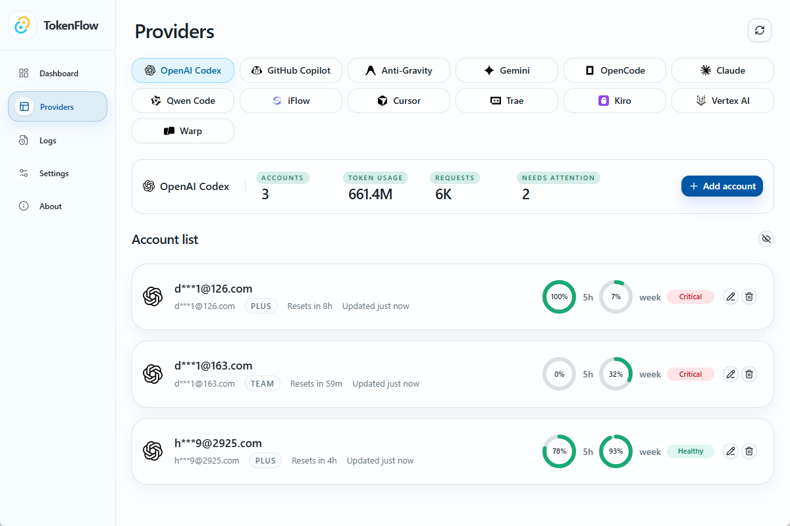
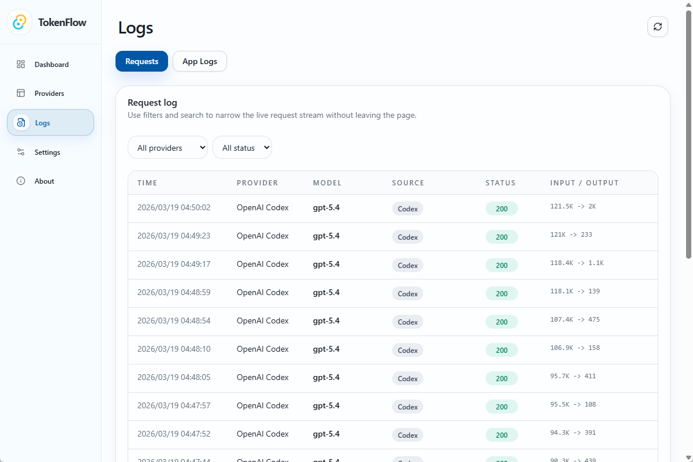
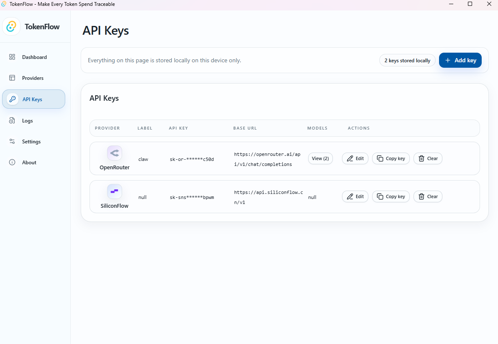
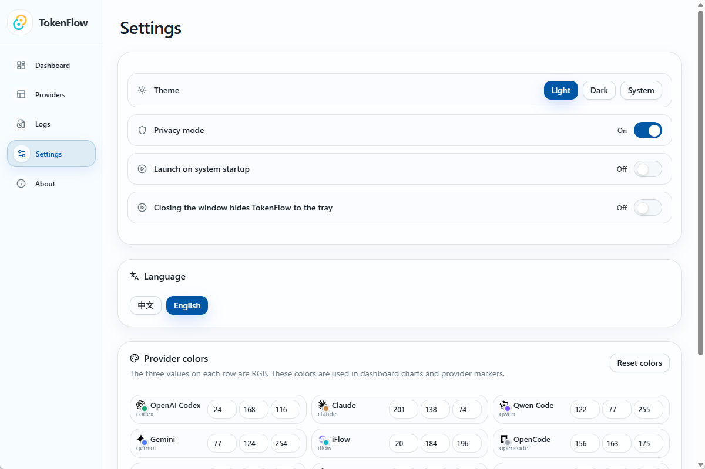
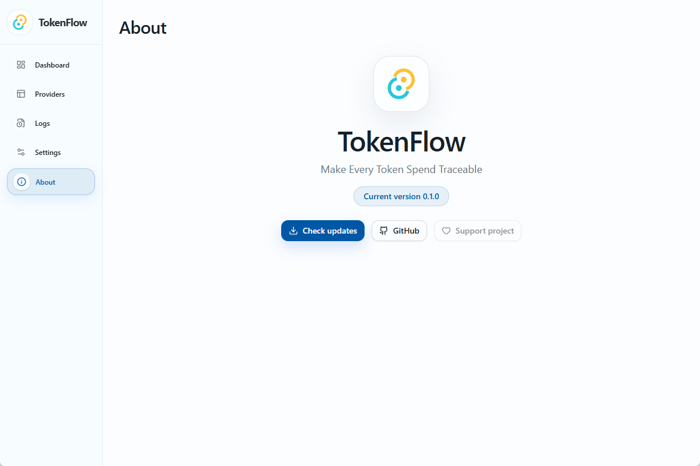

[English](./README.md) | [简体中文](./README.zh-CN.md)

# TokenFlow


TokenFlow 是一个面向 Windows 的 AI 编码账号与额度管理桌面应用，用来把多个主力 provider 的真实额度窗口放到同一个本地工作台里查看。

它不会把所有平台硬压成一个假的统一额度模型，而是尽量保留每个 provider 自己的额度语义。你可以在一个应用里连接账号、对比额度窗口、查看请求活动、排查日志，并把本地 AI 工具链整理得更清楚。



## 为什么用 TokenFlow

- 一个桌面工作区统一管理主要 AI 编码账号
- 保留 provider-native quota 语义，而不是猜测式统一百分比
- 快速查看账号 plan、健康状态、重置时间和最近更新时间
- 提供本地日志和请求可见性，方便排查问题
- 本地优先存储，敏感凭据保存在系统凭据存储中
- 提供 Windows 安装包和基于 GitHub Releases 的更新能力

## 当前支持的 Providers

当前 README 重点展示这 5 个 provider：

- OpenAI Codex
- Cursor
- Trae
- Anti-Gravity
- GitHub Copilot

不同 provider 的接入方式并不完全相同。有些走 OAuth，有些读取本地会话，有些能提供更完整的额度窗口信息。

## 截图

| Dashboard | Providers |
| --- | --- |
|  |  |

| Logs | API Keys |
| --- | --- |
|  |  |

| Settings | About |
| --- | --- |
|  |  |

## 安装

### 下载安装

从 [Releases](https://github.com/howarddong711/TokenFlow/releases/latest) 页面下载最新的 Windows 安装包。

当前发布资产包括：

- 带版本号的 NSIS `.exe` 安装包
- 带版本号的 `.msi` 安装包
- 用于应用内更新的签名元数据

### 从源码构建

1. 克隆仓库：

```bash
git clone https://github.com/howarddong711/TokenFlow.git
cd TokenFlow
```

2. 安装依赖：

```bash
npm install
```

3. 启动桌面开发环境：

```bash
npm run tauri -- dev
```

4. 构建前端：

```bash
npm run build
```

5. 构建 Windows 发布包：

```bash
npm run tauri -- build
```

## OAuth 环境变量

部分 provider 登录流程需要私有 OAuth 凭据，这些值不会存放在仓库中。

```bash
TOKENFLOW_ANTIGRAVITY_CLIENT_ID=
TOKENFLOW_ANTIGRAVITY_CLIENT_SECRET=
TOKENFLOW_IFLOW_CLIENT_ID=
TOKENFLOW_IFLOW_CLIENT_SECRET=
```
